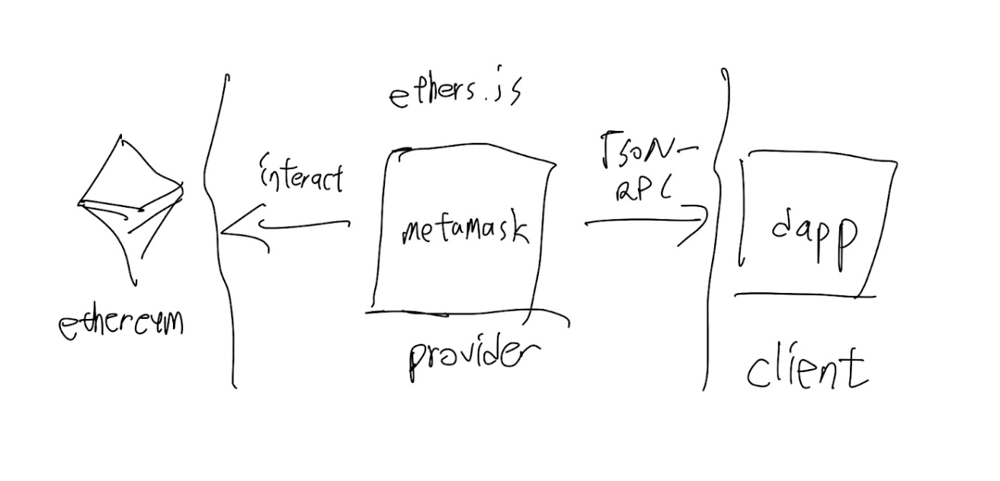

## ethers.js와 web3.js는 React.js 라이브러리 내에서 어떠한 역할을 하며, 무슨 차이가 있나요?
### Dapp 과 관련된 특정 주요 데이터(사용자의 현재 계정, chain id, provider 등)를 최신상태로 유지해주는 state machine 입니다.

### The ethers library creates a strong division between the operation a Provider can perform and those of a Signer, which Web3.js lumps together.

### https://docs.ethers.io/v5/api/providers/provider/

## ethers.js의 동작 방식은 어떻게 되는지 그림을 그려 설명해주세요.

### 

## Ethereum에서 Provider란 무엇인가요? 지갑마다 Provider는 서로 다르게 구현되어 있나요? 만약 그렇다면, Provider가 파편화되는 문제가 발생하지 않을까요? 어떻게 해결할 수 있을까요?

### A Provider in ethers is a read-only abstraction to access the blockchain data.[https://docs.ethers.io/v5/api/providers/provider/]

### 지갑마다 개인키를 가져옴으로서 해결한다.

## Solidity의 event 기능에 대해 설명해주세요. 프론트엔드에서 웹 후크에 대한 개념을 찾아보고, Solidity의 event 개념을 활용하여 어떻게 웹 후크를 구현할 수 있을 지 설명해주세요.

### event 라는 것은 블록체인 네트워크의  블록에 특정값을 기록하는 것을 말합니다. 특정 이벤트가 발생하는 경우 emit이 발생하므로 이를 event listen 하여 callback함수로 원하는 기능을 실행합니다.

## Ethereum 컨트랙트에서 verify 가 중요한 이유를 설명해주세요. 또한, verify 되는 과정을 그림으로 설명해주세요.

### Source code verification provides transparency for users interacting with smart contracts. By uploading the source code, Etherscan will match the compiled code with that on the blockchain. Just like contracts, a "smart contract" should provide end users with more information on what they are "digitally signing" for and give users an opportunity to audit the code to independently verify that it actually does what it is supposed to do. [https://etherscan.io/verifyContract]

### code publish - verify contract code - confirm contract detail
###
